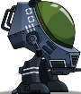
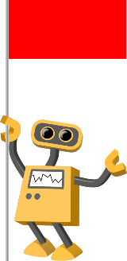
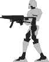

# Final Project

Read [this document](https://cliutils.gitlab.io/modern-cmake/chapters/basics/structure.html) to understand the project
layout.

**Author**: Nathan Omerza - [`nomerza2@illinois.edu`](mailto:nomerza2@illinois.edu)

---
**Requirements and Dependencies**
 
-Windows

This project was created for a windows computer. Functionality cannot be guaranteed on other operating systems.

-[CMake](https://cmake.org/)

This a CMake project. CMake is used to build and link project files. CMake will be necessary to run this project.

-[Microsoft Visual Studio 2015](https://my.visualstudio.com/Downloads?q=visual%20studio%202015&wt.mc_id=o%7Emsft%7Evscom%7Eolder-downloads)

Visual Studio 2015 is necessary to run the Cinder library. Cinder was designed for Visual Studio 2015, so later versions
will not work. 

-[Cinder](https://libcinder.org/download)

In the \Cinder folder where Cinder was installed, create a folder called "my-projects".
This project should be placed inside that folder

A guide for installing Visual Studio and Cinder can be found [here,](https://courses.grainger.illinois.edu/cs126/sp2020/assignments/snake/)
under the "Setting Up Cinder + Snake" section (and the "Windows Users - READ THIS" dropdown). This guide explains, uses
CLion as the development IDE, but this isn't necessary. If you aren't using CLion, follow your development environment's
instructions for adding Visual Studio as the environment and Cinder as an external library.

-[Box2D](https://box2d.org/)

Box2D is a two-dimensional physics engine used in this project. Box2D controls all object creation, movement, and collisions.
Box2D is a CinderBlock that has been imported as part of the CMake files, so no additional installation is need for the user.

---
**Keyboard Controls**
 
Space - Fire weapon or start game
 
Arrow Keys - Move side to side or jump
 
r - Restart Game

---
**Game Instructions**
 

 
You control this robot. Your goal is to get to the finish line at the right without dying.
 
The finish line is marked by this flag robot.
 

 
Your life counter is shown in the top-left corner.
 
These enemies can shoot you.
 

 
If you are shot, you will lose a life. If you lose all your lives, you lose the game.
 
You can shoot the enemy robots back by firing your weapon. Shooting the enemy robots will destroy them.
 
You can also die if you fall in an open pit. This will kill you no matter how many lives you have, so try to avoid falling.
 
If you die, you can restart the game from the beginning by pressing the 'r' key.
 
 
Have Fun!